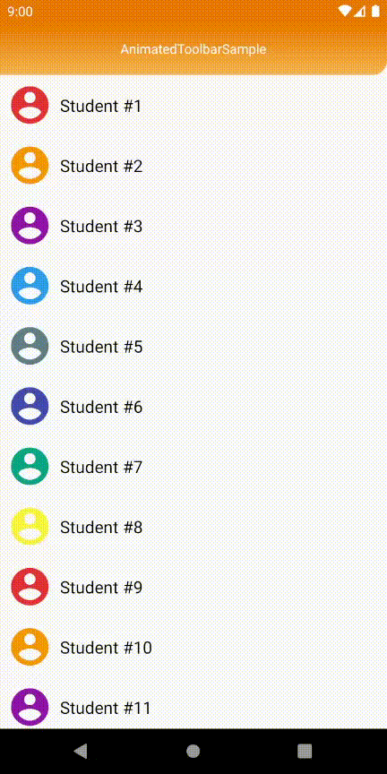

# Animated Toolbar
[](https://search.maven.org/artifact/com.ehsanmsz/animated-toolbar/0.7.1/aar)
[](https://github.com/EhsanMsz/Animated-Toolbar/blob/master/LICENSE.txt)
[](https://github.com/EhsanMsz/Animated-Toolbar/issues)


Simple toolbar animation for android

<div align="center">
    
</div>

# Download

Gradle:
```groovy
dependencies {
    implementation 'com.ehsanmsz:animated-toolbar:0.7.2'
}
```

Maven:
```xml
<dependency>
  <groupId>com.ehsanmsz</groupId>
  <artifactId>animated-toolbar</artifactId>
  <version>0.7.2</version>
  <type>aar</type>
</dependency>
```
  
# Example

Simply add `AnimatedToolbar` to layout:

```xml
<com.ehsanmsz.animatedtoolbar.AnimatedToolbar
    android:id="@+id/toolbar"
    android:layout_width="match_parent"
    android:layout_height="wrap_content"
    android:gravity="top"
    android:elevation="8dp">

        <TextView
            android:layout_width="match_parent"
            android:layout_height="wrap_content"
            android:textColor="@android:color/white"
            android:text="@string/app_name"
            android:gravity="center"/>

</com.ehsanmsz.animatedtoolbar.AnimatedToolbar>
 ```
and set `AnimatedToolbar` in `Activity`:
```kotlin
val animatedToolbar = findViewById<AnimatedToolbar>(R.id.toolbar)

setSupportActionBar(animatedToolbar)
```
---
## Customization:

### `xml` attributes:

|Attribute                     |                                                                |                                               |
|------------------------------|----------------------------------------------------------------|-----------------------------------------------|
|app:animatedToolbarStyle      |toolbar style                                                   |                                               |
|app:duration                  |toolbar animation duration in milliseconds                      |                                               |
|app:animationEnabled          |enable/disable toolbar animation                                |true, false                                    |
|app:usingSharedElement        |when shared element transition is used, the view animation in `AnimatedToolbarLayout` will be disabled|true, false|
|app:shape                     |toolbar shape                                                   |ramp, rounded, curved                          |
|app:shapeGravity              |toolbar shape gravity                                           |left, right                                    |
|app:toolbarStartColor         |toolbar start color                                             |                                               |
|app:toolbarEndColor           |toolbar end color                                               |                                               |
|app:toolbarColorAngle         |toolbar gradient color angle                                    |                                               |
|app:rampAngle                 |toolbar ramp shape angle                                        |                                               |
|app:roundedRadius             |toolbar rounded shape corner radius                             |                                               |
|app:curvedRadius              |toolbar curved shape corner radius                              |                                               |
---
- If you want to use `AnimatedToolbar` with **shared element**, set `app:usingSharedElement="true"`. it will disable animation for floating view.

- To render output in android studio xml preview, set `tools:animationEnabled="false"`.
---
### Animated Toolbar with floating view:
A view can be added to `AnimatedToolbar` and animate with it using `AnimatedToolbarLayout`.
<div align="center">
    
</div>

`AnimatedToolbarLauout` is basically a `ConstraintLayout` and can contain `AnimatedToolbar` and `View`.

```xml
<com.ehsanmsz.animatedtoolbar.AnimatedToolbarLayout
    android:layout_width="match_parent"
    android:layout_height="wrap_content"
    app:layout_constraintTop_toTopOf="parent">

    <com.ehsanmsz.animatedtoolbar.AnimatedToolbar
        android:id="@+id/toolbar"
        android:layout_width="match_parent"
        android:layout_height="200dp"
        android:elevation="8dp"
        android:gravity="top"
        app:rampAngle="30"
        app:shape="ramp"
        app:shapeGravity="left"
        app:toolbarColorAngle="90"
        app:toolbarEndColor="@color/colorPrimary"
        app:toolbarStartColor="@color/colorPrimaryDark"
        tools:animationEnabled="false">

        <TextView
            android:layout_width="match_parent"
            android:layout_height="wrap_content"
            android:gravity="center"
            android:paddingTop="8dp"
            android:text="@string/student"
            android:textColor="@android:color/white" />

    </com.ehsanmsz.animatedtoolbar.AnimatedToolbar>

    <ImageView
        android:id="@+id/imageView"
        android:layout_width="wrap_content"
        android:layout_height="wrap_content"
        android:elevation="12dp"
        app:layout_constraintBottom_toBottomOf="parent"
        app:layout_constraintEnd_toEndOf="parent"
        app:layout_constraintStart_toStartOf="parent"
        app:srcCompat="@drawable/ic_account_circle_92" />

</com.ehsanmsz.animatedtoolbar.AnimatedToolbarLayout>
```

# License
```
Copyright 2020 Ehsan msz

Licensed under the Apache License, Version 2.0 (the "License");
you may not use this file except in compliance with the License.
You may obtain a copy of the License at

http://www.apache.org/licenses/LICENSE-2.0

Unless required by applicable law or agreed to in writing, software
distributed under the License is distributed on an "AS IS" BASIS,
WITHOUT WARRANTIES OR CONDITIONS OF ANY KIND, either express or implied.
See the License for the specific language governing permissions and
limitations under the License.
```
